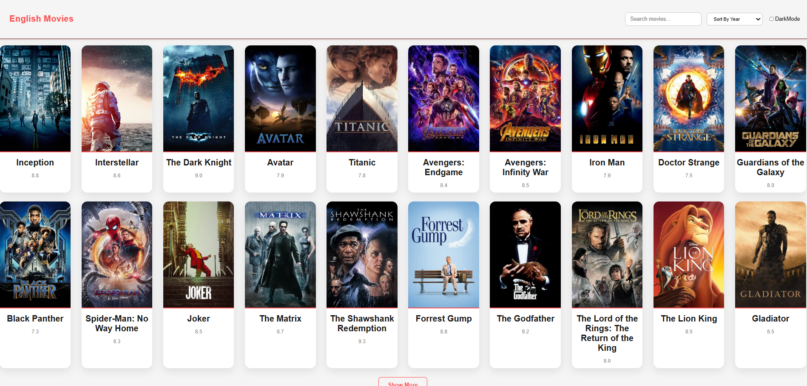
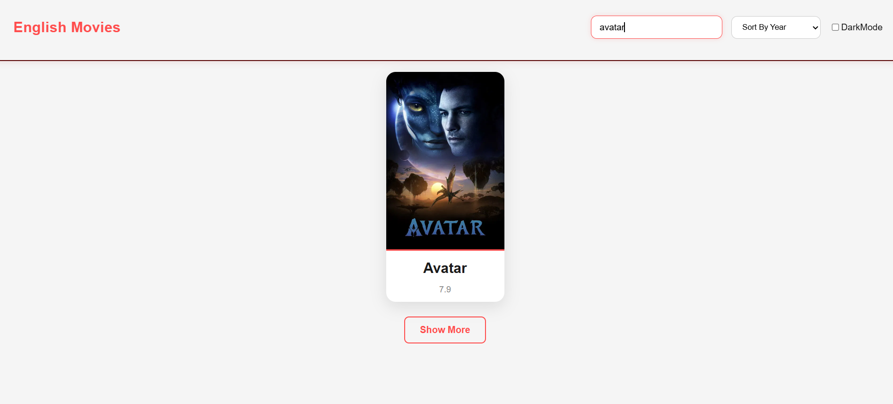
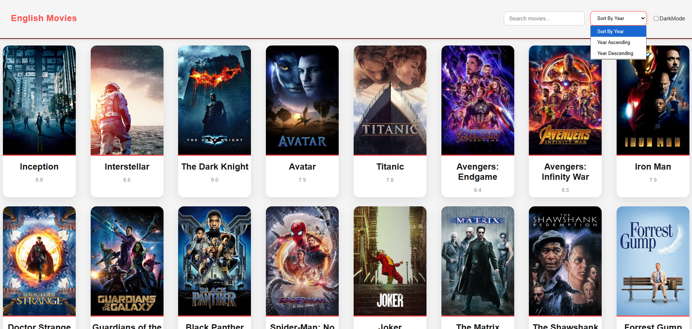
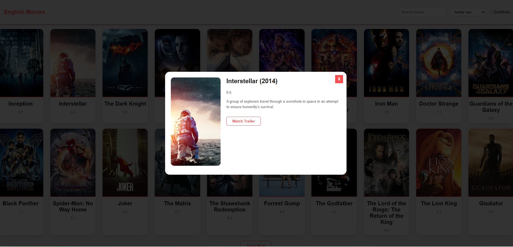
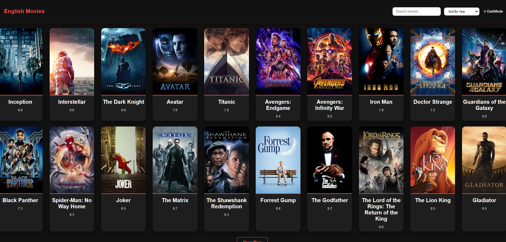

# 🎬 Movie Explorer Web Application

A modern and responsive Movie Explorer application built using React.js that allows users to search movies, view detailed movie information, explore ratings, and discover trending films through real-time API integration.

---

# 📖 Project Description

Movie Explorer is a dynamic web application developed to help users search and discover movies easily. Users can search for movies by title and instantly view detailed information such as movie posters, release dates, ratings, genres, plot summaries, and cast details.

The application fetches movie data from an external movie database API and presents it through a clean and user-friendly interface. It also includes Dark Mode functionality and a fully responsive design to ensure a smooth experience across all devices.

This project demonstrates practical knowledge of React.js, API integration, state management, responsive web design, and modern frontend development practices.

---

## 🚀 Live Demo

https://saikumar-009.github.io/Movie-Website/


---

# 💻 GitHub Repository

Repository Link:

https://github.com/saikumar-009/movie-Website

---

## 📸 Screenshots

### Home Page



### Search Results



### SortByYear Results



### Movie Details



### Dark-Mode Results




---

# ✨ Features

### 🔍 Movie Search
Users can search movies by entering a movie title.

### 🎥 Movie Details
Displays comprehensive movie information including:

- Movie Title
- Movie Poster
- Release Date
- IMDb Rating
- Genre
- Language
- Runtime
- Plot Summary

### 🌟 Trending Movies
Displays popular and trending movies.

### 🌙 Dark Mode
Allows users to switch between Light and Dark themes.

### 📱 Responsive Design
Optimized for:

- Mobile Devices
- Tablets
- Laptops
- Desktop Screens

### ⚡ API Integration
Fetches real-time movie data from an external movie API.

### 🚫 Error Handling
Displays meaningful messages when:

- Movie is not found
- API request fails
- Search field is empty

### 🔄 Dynamic Content Rendering
Updates movie results instantly based on user searches.

---

# 🛠️ Technologies Used

## Frontend Technologies

- React.js
- JavaScript (ES6+)
- HTML5
- CSS3

## API Integration

- Fetch API
- OMDb API / TMDB API

## Development Tools

- Git
- GitHub
- VS Code

---

# 🚀 How It Works

### Step 1

User enters a movie title in the search bar.

Example:

bash
Avengers


### Step 2

React sends a request to the Movie API using Fetch API.

### Step 3

The API returns matching movie data.

### Step 4

Movie cards are displayed dynamically on the screen.

### Step 5

Users can explore movie information such as ratings, release dates, genres, and plot details.

---

# 🎯 Challenges Faced

During development, several challenges were encountered:

### API Integration

Fetching and displaying movie data efficiently from external APIs.

### State Management

Managing search queries, loading states, and movie results.

### Conditional Rendering

Displaying loading indicators, movie information, and error messages dynamically.

### Responsive Design

Creating layouts that work seamlessly across devices.

### Dark Mode Implementation

Managing theme state and dynamically updating UI styles.

---

# 📚 Key Learnings

This project helped me strengthen my knowledge of:

- React Functional Components
- React Hooks (useState, useEffect)
- API Integration
- Fetch API
- State Management
- Conditional Rendering
- Responsive Design
- Component-Based Architecture
- Git and GitHub Workflow

---

## ⚙️ Installation

```bash
git clone https://github.com/yourusername/movie-website.git
cd movie-website
npm install
npm start
```

---

# 🚀 Future Improvements

Planned features for future releases:

- User Authentication
- Watchlist Functionality
- Favorite Movies Feature
- Movie Trailer Integration
- Genre-Based Filtering
- Pagination Support
- Advanced Search Filters
- Movie Recommendation System

---

# 👨‍💻 Author

Name: ALUPANA SAI

GitHub:
https://github.com/saikumar-009

LinkedIn:
https://www.linkedin.com/in/alupanasai/

Email:
alupanasai3535@gmail.com

---

# ⭐ Support

If you found this project useful, please consider giving it a ⭐ on GitHub.

It helps others discover the project and supports my learning journey.

---

Thank You for Visiting! 🚀

